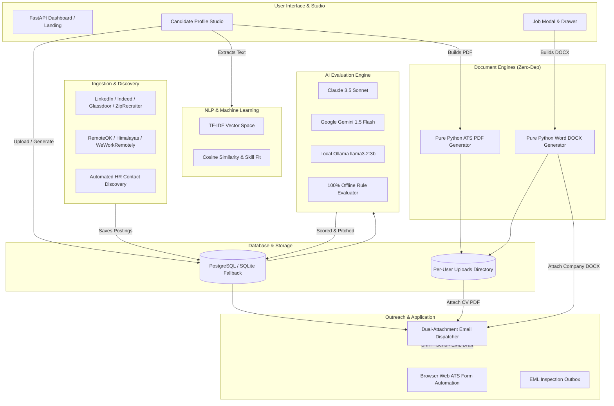

# 🚀 AutoHunt: Autonomous AI Job Search & Freelance Acquisition Platform

An enterprise-grade, autonomous 24/7 job discovery, AI evaluation, client acquisition, and auto-apply platform. Built with a modern Python architecture, **AutoHunt** enables every registered user to manage their own candidate profile and CV directly in the web dashboard, generates company-dedicated motivation letters in Microsoft Word (`.docx`) format, and dispatches job applications with dual document attachments.

---

## 📑 Table of Contents

- [Architectural Highlights & Roots](#-architectural-highlights--roots)
- [System Architecture](#-system-architecture)
- [Core Technologies & Tools Used](#-core-technologies--tools-used)
- [Component Breakdown & How It Works](#-component-breakdown--how-it-works)
  - [1. Candidate Profile Studio & CV Management](#1-candidate-profile-studio--cv-management)
  - [2. Company-Dedicated Motivation Letter Generator (.docx)](#2-company-dedicated-motivation-letter-generator-docx)
  - [3. Machine Learning & Vector Fit Analysis](#3-machine-learning--vector-fit-analysis)
  - [4. Multi-Source Ingestion & HR Enrichment](#4-multi-source-ingestion--hr-enrichment)
  - [5. Hybrid AI & Heuristic Evaluation Engine](#5-hybrid-ai--heuristic-evaluation-engine)
  - [6. Autonomous Application & Outreach Dispatcher](#6-autonomous-application--outreach-dispatcher)
  - [7. Freelance Client Acquisition Hub](#7-freelance-client-acquisition-hub)
  - [8. Security, Multi-Tenancy & Universal Payments](#8-security-multi-tenancy--universal-payments)
- [Quick Start Guide](#-quick-start-guide)
  - [Option A: Running with Docker (Recommended)](#option-a-running-with-docker-recommended)
  - [Option B: Running Locally (Python & PowerShell / Bash)](#option-b-running-locally-python--powershell--bash)
- [Configuration Reference (.env)](#-configuration-reference-env)
- [Verification & Automated Tests](#-verification--automated-tests)
- [Repository Structure & File Map](#-repository-structure--file-map)

---

## 🌟 Architectural Highlights & Roots

1. **Dashboard-Driven Per-User CV Management**
   - No hardcoded single-file resumes. Every registered user manages their own candidate profile in the Dashboard Studio.
   - Users can **upload an existing PDF/DOCX/TXT resume** or click **⚡ Generate CV (PDF)** to compile an ATS-compliant resume directly from their profile details.
   - User resumes are isolated into secure per-user storage (`uploads/resumes/user_{uid}/`).

2. **Company-Dedicated Motivation Letters in `.docx` Format**
   - For every target company and role, the system generates a tailored motivation letter highlighting the user's matching tech stack, accomplishments, and alignment with the company.
   - Generated as an authentic Microsoft Word document (`.docx`) formatted with standard letterhead, clean typography, margin layout, and professional sign-off.
   - Generated with zero external pip/C dependencies using Python's standard OpenXML packaging (`zipfile` + XML).

3. **Dual-Attachment Outbound Email Applications**
   - When an application is sent (or drafted as `.eml`), the system attaches **both**:
     - 📎 **Attachment 1:** The user's active CV (`{Candidate_Name}_Resume.pdf`).
     - 📎 **Attachment 2:** The company-dedicated motivation letter (`{Candidate_Name}_Motivation_Letter_{Company}.docx`).
   - The email body dynamically references both attached documents in English or French.

4. **Pure Python Zero-Dependency Document Generation**
   - **ATS PDF Generator** (`src/candidate/cv_generator.py`): Pure Python binary PDF 1.4 engine with font metrics, multi-line wrapping, divider rules, and clean typography.
   - **Word DOCX Generator** (`src/candidate/cover_letter_generator.py`): Pure Python Open Packaging Conventions (OPC) OpenXML `.docx` generator.

5. **TF-IDF & Vector Cosine Similarity Fit Engine**
   - CV and job descriptions are vectorized using NLP tokenization and TF-IDF weighting.
   - Computes mathematical cosine similarity, matched skills, missing skill gaps, seniority fit, and degree alignment.

6. **Dual Database Architecture (PostgreSQL + SQLite Fallback)**
   - Supports production PostgreSQL with connection pooling.
   - Automatically detects missing database drivers or unconfigured PostgreSQL and falls back gracefully to local SQLite (`jobsearch_local.db`).

---

## 🏛 System Architecture



---

## 🛠 Core Technologies & Tools Used

### Backend & Core
- **Python 3.12+**: Modern typed Python with `__future__.annotations`.
- **FastAPI**: High-performance asynchronous web framework powering all REST endpoints and WebSockets.
- **Uvicorn / Starlette**: ASGI server with low latency and streaming responses.
- **Pydantic v2 & Pydantic-Settings**: Schema validation, request validation, and environment configuration.

### Database & Persistence
- **SQLAlchemy 2.0**: Modern declarative ORM models (`Mapped`, `mapped_column`, `select`, `and_`, `or_`).
- **PostgreSQL**: Production-grade relational database for multi-user transactional data and indexing.
- **SQLite 3**: Zero-config, self-contained local database fallback (`jobsearch_local.db`).

### AI, Machine Learning & NLP
- **Anthropic Claude (Claude 3.5 Sonnet)**: High-accuracy structured job evaluation, candidate fit scoring, and bilingual proposal drafting.
- **Google Gemini (Gemini 1.5 Flash)**: Fast cloud AI inference for batch evaluation.
- **Ollama (`llama3.2:3b`)**: 100% free, private local LLM running in Docker.
- **Pure-Python NLP & Heuristic Scorer**: Tokenizer, keyword extractor, and vector cosine similarity engine that operates with zero paid API keys.

### Document & File Generation
- **Pure Python PDF 1.4 Engine**: Built-in binary PDF stream generator for ATS-ready resumes with zero pip C-dependencies.
- **Pure Python OpenXML (.docx) Engine**: OPC ZIP archive generator producing official Microsoft Word `.docx` motivation letters.
- **`pypdf` & Text Extractors**: Extracts clean resume text from uploaded PDF/Word/Text documents.

### Ingestion & Scraping
- **JobSpy**: Multi-board job scraper for LinkedIn, Indeed, Glassdoor, and ZipRecruiter.
- **Playwright**: Headless Chromium browser automation for web ATS forms, screenshots, and complex dynamic portals.
- **Requests & BeautifulSoup4**: Scraping public feeds (Hacker News, Reddit, RemoteOK, Himalayas, WeWorkRemotely).

### Real-Time & Event Communication
- **WebSockets**: Live dashboard notification stream and background progress updates.
- **Server-Sent Events (SSE)**: Live tail of system logs and background pipeline workers.
- **RabbitMQ / Apache Kafka**: Production message broker integration for distributed notifications.

### Frontend & UI
- **Vanilla Modern JavaScript (ES2022)**: Fast, zero-build-step client application with no NPM bundle overhead.
- **Custom CSS Design System**: Dark-mode glassmorphic theme, CSS variables, and responsive layout.
- **Typography**: Inter (UI text) and JetBrains Mono (code, data matrices, and logs).

---

## 🔍 Component Breakdown & How It Works

### 1. Candidate Profile Studio & CV Management
* **Location:** [`src/candidate/profile_manager.py`](file:///c:/Users/xbamb/Music/build_jobsearch%20(2)/build_jobsearch/src/candidate/profile_manager.py) & [`src/candidate/cv_generator.py`](file:///c:/Users/xbamb/Music/build_jobsearch%20(2)/build_jobsearch/src/candidate/cv_generator.py)
* **How It Works:**
  - Users create and maintain candidate profiles containing: target job titles, core tech stack, negative keywords, locations, years of experience, and freelance rates.
  - **Upload CV:** Users upload their existing PDF, Word, or Text resume. The file is saved in `uploads/resumes/user_{uid}/`, its text is extracted, and NLP automatically pulls detected skills into the profile.
  - **Generate CV (PDF):** The built-in ATS PDF generator builds an ATS-friendly resume from the profile details without external dependencies.
  - **Active Profile Switching:** Switching the active profile instantly updates search matrices, query generators, and outbound applications.

### 2. Company-Dedicated Motivation Letter Generator (.docx)
* **Location:** [`src/candidate/cover_letter_generator.py`](file:///c:/Users/xbamb/Music/build_jobsearch%20(2)/build_jobsearch/src/candidate/cover_letter_generator.py)
* **How It Works:**
  - Analyzes the job posting (title, company, description, language) and candidate profile.
  - Generates tailored paragraphs:
    1. Introduction referencing the company name and role.
    2. Technical experience mapped to the candidate's core stack.
    3. Value proposition explaining how the candidate solves the company's challenges.
    4. Call to action referencing the attached CV and requesting an interview.
  - Compiles the letter into a native Microsoft Word (`.docx`) file with:
    - Candidate letterhead (Name, Title, Email, Phone, Location).
    - Date and recipient company block.
    - Formal subject line (`Objet: Candidature au poste de...` / `Subject: Application for...`).
    - Standard paragraph formatting, line spacing, and margins.
  - Available for live preview and download in the dashboard Job Modal (`/api/jobs/{id}/motivation_letter/download`).

### 3. Machine Learning & Vector Fit Analysis
* **Location:** [`src/candidate/cv_ml_engine.py`](file:///c:/Users/xbamb/Music/build_jobsearch%20(2)/build_jobsearch/src/candidate/cv_ml_engine.py)
* **How It Works:**
  - Tokenizes CV text and job descriptions with stop-word removal.
  - Builds TF-IDF weight vectors.
  - Computes Cosine Similarity ($0.00$ to $1.00$).
  - Produces:
    - Percentage Match Score ($0$–$100\%$).
    - Matched key skills (e.g. `Python`, `FastAPI`, `Docker`).
    - Missing skills / gap analysis.
    - Seniority alignment (Junior, Mid, Senior, Lead).
    - Education/degree level verification.

### 4. Multi-Source Ingestion & HR Enrichment
* **Location:** [`src/ingestion/`](file:///c:/Users/xbamb/Music/build_jobsearch%20(2)/build_jobsearch/src/ingestion/) & [`src/ingestion/hr_enrichment.py`](file:///c:/Users/xbamb/Music/build_jobsearch%20(2)/build_jobsearch/src/ingestion/hr_enrichment.py)
* **How It Works:**
  - Ingests opportunities from LinkedIn, Indeed, Glassdoor, ZipRecruiter, Himalayas, RemoteOK, and WeWorkRemotely.
  - Scans job descriptions for application emails.
  - If no direct email is listed, the **HR Enrichment Engine** checks company websites and career pages to find verified recruitment contacts (`jobs@`, `careers@`, `talent@`, `recruiting@`).

### 5. Hybrid AI & Heuristic Evaluation Engine
* **Location:** [`src/evaluation/`](file:///c:/Users/xbamb/Music/build_jobsearch%20(2)/build_jobsearch/src/evaluation/)
* **How It Works:**
  - Evaluates each job using a multi-tier fallback:
    1. **Primary:** Claude 3.5 Sonnet or Gemini 1.5 Flash.
    2. **Secondary:** Local Ollama (`llama3.2:3b`).
    3. **Fail-Safe:** Rule-based heuristic evaluation engine ($0$ API cost, offline).
  - Validates visa sponsorship, relocation assistance, experience requirements, and continent location.
  - Drafts custom bilingual pitches (`pitch_en` and `pitch_fr`).

### 6. Autonomous Application & Outreach Dispatcher
* **Location:** [`src/application/auto_apply.py`](file:///c:/Users/xbamb/Music/build_jobsearch%20(2)/build_jobsearch/src/application/auto_apply.py) & [`src/application/web_apply.py`](file:///c:/Users/xbamb/Music/build_jobsearch%20(2)/build_jobsearch/src/application/web_apply.py)
* **How It Works:**
  - **Recruiter Email Dispatch:**
    - Assembles the message with candidate sender details.
    - Attaches the candidate's CV (PDF).
    - Attaches the company-dedicated motivation letter (`.docx`).
    - In `draft` mode: writes clean `.eml` files to `outreach_drafts/` for manual inspection.
    - In `send` mode: securely dispatches via authenticated SMTP.
  - **Web ATS Form Automation:**
    - Uses Playwright to navigate to application portals (Greenhouse, Lever, Workday, etc.).
    - Fills in name, email, phone, LinkedIn, and uploads the candidate's CV.
    - Captures post-submission confirmation screenshots.
  - **Safety Guardrails:**
    - Daily outbound sending caps per user.
    - Global kill switches.
    - Idempotency keys preventing accidental duplicate emails.
    - Suppression lists and domain blacklists.

### 7. Freelance Client Acquisition Hub
* **Location:** [`src/freelance/`](file:///c:/Users/xbamb/Music/build_jobsearch%20(2)/build_jobsearch/src/freelance/)
* **How It Works:**
  - Scrapes client requests from Hacker News (*"Who is hiring?"*), Reddit (*r/forhire*, *r/freelance_forhire*), Jobicy, and RemoteOK.
  - Filters out spam, unpaid projects, and equity-only solicitations.
  - Generates tailored proposals across three strategic angles:
    - ⚡ **MVP Speed:** 7–14 day prototype roadmap.
    - 🛡️ **Architecture Quality:** Test coverage, clean domain architecture, and microservices.
    - 💡 **ROI Advisory:** Technical audits and cost optimization.
  - 1-Click Multi-Channel Copy: LinkedIn connect notes ($\le 300$ chars), Reddit/Discord DMs, and full emails.
  - Automated 2-step follow-up scheduler (+3 days and +7 days).

### 8. Security, Multi-Tenancy & Universal Payments
* **Location:** [`src/auth/`](file:///c:/Users/xbamb/Music/build_jobsearch%20(2)/build_jobsearch/src/auth/) & [`src/storage/plans.py`](file:///c:/Users/xbamb/Music/build_jobsearch%20(2)/build_jobsearch/src/storage/plans.py)
* **How It Works:**
  - Multi-tenant user accounts with role-based access control (`ADMIN`, `USER`).
  - Secure bcrypt password hashing and HTTP-only session cookies.
  - Universal Multi-Method Payments: Web3 Crypto (USDT TRC20/Polygon, Solana, BTC), PayPal, Stripe/Credit Cards, Wise, Revolut, and local wire transfers.

---

## 🚀 Quick Start Guide

### Option A: Running with Docker (Recommended)

Docker bundles PostgreSQL, Ollama local AI, Playwright Chromium, the background discovery engine, the inbox monitor, and the web dashboard in isolated containers.

#### 1. Prerequisites
- [Docker Desktop](https://www.docker.com/products/docker-desktop/) (Windows / macOS) or Docker Engine (Linux).

#### 2. Setup
```bash
# Clone the repository
git clone https://github.com/bamboutcho-bit/jobest-hub.git
cd jobest-hub

# Create environment configuration from example
cp .env.example .env
```

#### 3. Build & Run
```bash
docker compose up --build -d
```

#### 4. Access the Platform
- **Dashboard & Job Hunter:** [http://localhost:8080](http://localhost:8080)
- **Freelance Acquisition Hub:** [http://localhost:8080/freelance](http://localhost:8080/freelance)
- **Default Credentials:** Defined in `.env` (default: `admin@autohunt.internal` / `password123`).

#### 5. Useful Docker Commands
```bash
# View live application logs
docker compose logs -f app

# Stop all services
docker compose down

# Start up without rebuilding
docker compose up -d
```

---

### Option B: Running Locally (Python & PowerShell / Bash)

To run directly on your host operating system without Docker:

#### 1. Create Virtual Environment
```powershell
# Windows PowerShell
python -m venv .venv
.\.venv\Scripts\Activate.ps1

# macOS / Linux
python3 -m venv .venv
source .venv/bin/activate
```

#### 2. Install Dependencies
```bash
pip install -r requirements.txt
```

*(Optional: Install Playwright browsers if using Web ATS automation)*
```bash
playwright install chromium
```

#### 3. Start the Web Dashboard
```bash
python -m uvicorn src.dashboard.app:app --host 0.0.0.0 --port 8080 --reload
```
> **Note:** If PostgreSQL is not running, the application will automatically fall back to SQLite (`jobsearch_local.db`) with zero manual configuration needed.

#### 4. Run Scheduled Background Tasks (Optional Terminals)
```bash
# Terminal 2: Run automated job discovery loop every 4 hours
python scripts/run_pipeline.py --loop --interval-hours 4

# Terminal 3: Run continuous inbox monitor for recruiter replies
python scripts/check_inbox.py --loop
```

---

## ⚙️ Configuration Reference (.env)

| Variable | Default | Purpose |
| :--- | :--- | :--- |
| `DATABASE_URL` | `sqlite:///./jobsearch_local.db` | SQLAlchemy connection URI (PostgreSQL or SQLite). |
| `ADMIN_EMAIL` | `admin@autohunt.internal` | Master administrator login email. |
| `ADMIN_PASSWORD` | `password123` | Master administrator login password. |
| `AI_PROVIDER` | `heuristic` | AI engine: `claude`, `gemini`, `ollama`, or `heuristic`. |
| `CLAUDE_API_KEY` | *(empty)* | Anthropic API key for Claude 3.5 Sonnet. |
| `GEMINI_API_KEY` | *(empty)* | Google Gemini API key. |
| `OLLAMA_BASE_URL` | `http://localhost:11434` | Address of local Ollama instance. |
| `AUTO_APPLY_MODE` | `draft` | `draft` writes `.eml` files; `send` sends live emails. |
| `OUTBOUND_SEND_ENABLED` | `false` | Master safety switch for live email dispatch. |
| `SMTP_HOST` | `smtp.gmail.com` | Outgoing email server host. |
| `SMTP_PORT` | `587` | Outgoing email server port. |
| `SMTP_USER` | *(empty)* | Outgoing email username / address. |
| `SMTP_PASSWORD` | *(empty)* | SMTP application password (e.g. Gmail App Password). |
| `TELEGRAM_BOT_TOKEN` | *(empty)* | Telegram Bot token for mobile recruiter alerts. |
| `TELEGRAM_CHAT_ID` | *(empty)* | Telegram target chat ID. |
| `CALENDAR_BOOKING_URL` | *(empty)* | Your Cal.com or Calendly link injected into outreach. |

---

## 🧪 Verification & Automated Tests

The codebase includes an extensive automated test suite covering candidate profiles, document generation, scoring accuracy, and outbound messaging:

```bash
# Run the complete test suite
python -m pytest -v

# Run candidate profile and CV upload/generation tests
python -m pytest tests/test_candidate_profiles.py -v

# Run motivation letter .docx generator tests
python -m pytest tests/test_motivation_letter_docx.py -v

# Run accuracy and evaluation scoring tests
python -m pytest tests/test_accuracy_evaluation.py -v
```

---

## 📂 Repository Structure & File Map

```text
build_jobsearch/
├── config/
│   ├── candidate_profile.py     # Default profile settings & search matrix fallbacks
│   └── settings.py              # Environment configuration & Pydantic settings
├── src/
│   ├── application/
│   │   ├── auto_apply.py        # Outbound application dispatcher & dual-attachment emailer
│   │   └── web_apply.py         # Playwright browser automation for web ATS portals
│   ├── auth/
│   │   └── service.py           # User authentication, JWT sessions, and RBAC
│   ├── candidate/
│   │   ├── cover_letter_generator.py  # Pure Python OpenXML (.docx) motivation letter builder
│   │   ├── cv_generator.py            # Pure Python ATS PDF resume builder
│   │   ├── cv_ml_engine.py            # TF-IDF vector extraction & cosine similarity matcher
│   │   └── profile_manager.py         # Multi-tenant profile manager & CV resolver
│   ├── dashboard/
│   │   ├── app.py               # FastAPI application, REST endpoints, WebSockets & SSE
│   │   ├── static/
│   │   │   ├── css/             # Modern dark-mode UI stylesheet
│   │   │   └── js/app.js        # Dashboard frontend SPA logic & Studio handlers
│   │   └── templates/
│   │       ├── dashboard.html   # Main control center & Candidate Profile Studio
│   │       ├── freelance.html   # Freelance Client Acquisition Studio
│   │       └── landing.html     # SaaS public landing page
│   ├── evaluation/
│   │   ├── claude_client.py     # Anthropic Claude LLM integration
│   │   ├── heuristic_scorer.py  # Offline deterministic candidate-job match scorer
│   │   ├── language.py          # Language detection (English / French routing)
│   │   └── prefilter.py         # Negative keywords, location & experience filtering
│   ├── freelance/
│   │   ├── orchestrator.py      # Freelance client scraping loop
│   │   ├── outreach.py          # 3-sprint proposal & follow-up generator
│   │   └── scrapers.py          # Hacker News, Reddit, Jobicy & RemoteOK scrapers
│   ├── inbox/
│   │   └── inbox_monitor.py     # IMAP inbox reply tracker & interview alert parser
│   ├── ingestion/
│   │   ├── hr_enrichment.py     # Automated HR contact & recruiter email discovery
│   │   ├── jobspy_scraper.py    # LinkedIn, Indeed, Glassdoor, ZipRecruiter connector
│   │   └── public_feeds.py      # RemoteOK, Himalayas, WeWorkRemotely RSS scrapers
│   ├── notifications/
│   │   └── hub.py               # Real-time WebSocket and alert dispatch hub
│   └── storage/
│       ├── db.py                # SQLAlchemy engine initialization with SQLite auto-fallback
│       ├── models.py            # Database tables (Users, Jobs, Profiles, Outbox, Events)
│       └── user_settings.py     # Per-user settings and credential storage
├── tests/
│   ├── test_accuracy_evaluation.py    # Experience, visa, and location scoring tests
│   ├── test_candidate_profiles.py     # Profile lifecycle, upload, and PDF generation tests
│   ├── test_motivation_letter_docx.py # .docx OpenXML structure & dual attachment tests
│   └── test_universal_payments.py     # Multi-method payment tests
├── uploads/
│   ├── resumes/user_{id}/       # Isolated storage for user-uploaded/generated CVs
│   └── cover_letters/user_{id}/ # Cached company-tailored .docx motivation letters
├── docker-compose.yml           # Multi-container orchestration (App, Postgres, Ollama)
├── Dockerfile                   # Production Python 3.12 container definition
└── requirements.txt             # Python dependencies
```

---

## 🔒 Security & Privacy Notice

- **No Third-Party Data Sharing:** AutoHunt runs on your infrastructure. Resumes, credentials, and application histories remain strictly within your local environment or private server.
- **Credential Protection:** Passwords are encrypted with `bcrypt`. Outgoing SMTP credentials are kept locally or inside environment variables.
- **Autonomous Safety Limits:** Hard daily outbound application limits prevent account suspension on third-party job boards and email providers.
